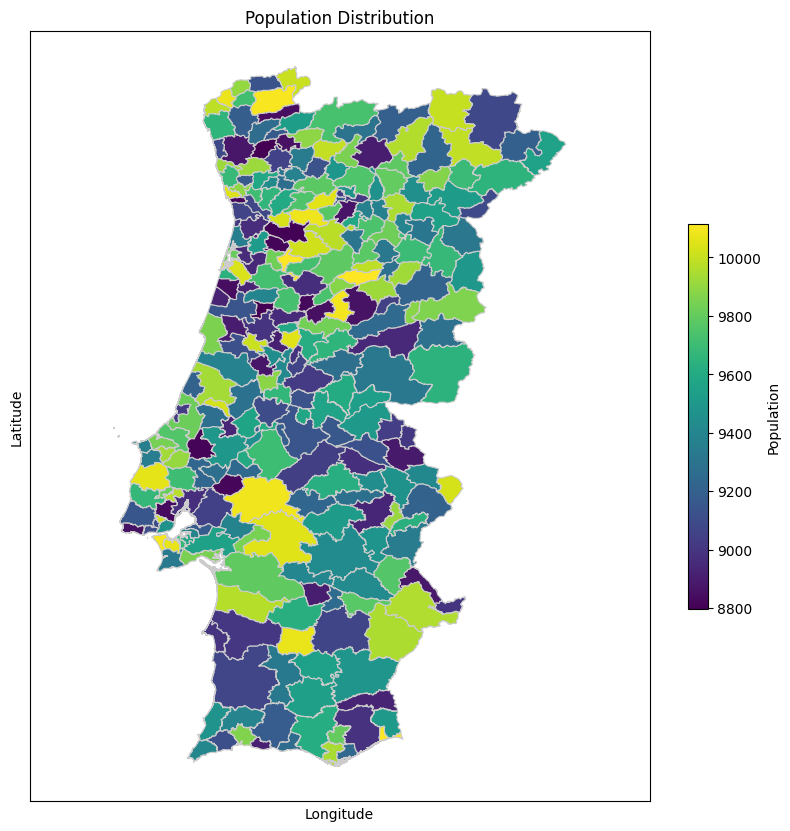

# Importar bibliotecas necessárias
Fazer o import e a instalação do necessário


```python
import geopandas as gpd
import matplotlib.pyplot as plt
from mpl_toolkits.axes_grid1 import make_axes_locatable
import json

import numpy as np
```

# Abrir ficheiro de dados
Neste projeto todos os ficheiros de dados foram retirados de [dados.gov.pt](dados.gov.pt).

## Iniciar o processamento
Inicialmente temos apenas acesso à população em cada freguesia, no entanto, para fazer um estudo detalhado sobre a densidade na população de Portugal é necessário saber tambem o seu posicionamento geográfico.

Assim, neste primeiro passo, procuramos estabelecer uma correspondencia entre o codigo postal e a população presente em cada um. Fazemos isto por analisar o ficheiro **indica.json**


```python
f = open("indica.json") 
data = json.load(f)

print(list(data[0]["Dados"]["2021"][0].keys()))

new_geocode = {}

for i in data[0]["Dados"]["2021"]:
    new_geocode[i["geocod"]] = i["valor"]

```

    ['geocod', 'geodsg', 'dim_3', 'dim_3_t', 'valor']


## Formato de cada Concelho

O formato de cada Concelho de Portugal encontra-se no ficheiro **concelhos-shapefile.zip**. 
Este contem a forma de todos os concelhos de Portugal, no entanto para este estudo não faz sentido considerar os arquipélagos da **Madeira** e **Açores**.


```python
shapefile = gpd.read_file("concelhos-shapefile.zip")
np.array(list(shapefile.columns)).T
```


    array(['ID_0', 'ISO', 'NAME_0', 'ID_1', 'NAME_1', 'ID_2', 'NAME_2',
           'HASC_2', 'CCN_2', 'CCA_2', 'TYPE_2', 'ENGTYPE_2', 'NL_NAME_2',
           'VARNAME_2', 'geometry'], dtype='<U9')


Exclusão dos arquipélagos


```python
shapefile["POP2021"] = shapefile['CCA_2'].map(new_geocode)
filtered_shapefile = shapefile[~shapefile['NAME_1'].isin(["Madeira","Azores"])]

filtered_shapefile.head()
```


<div>
<style scoped>
    .dataframe tbody tr th:only-of-type {
        vertical-align: middle;
    }

    .dataframe tbody tr th {
        vertical-align: top;
    }

    .dataframe thead th {
        text-align: right;
    }
</style>
<table border="1" class="dataframe">
  <thead>
    <tr style="text-align: right;">
      <th></th>
      <th>ID_0</th>
      <th>ISO</th>
      <th>NAME_0</th>
      <th>ID_1</th>
      <th>NAME_1</th>
      <th>ID_2</th>
      <th>NAME_2</th>
      <th>HASC_2</th>
      <th>CCN_2</th>
      <th>CCA_2</th>
      <th>TYPE_2</th>
      <th>ENGTYPE_2</th>
      <th>NL_NAME_2</th>
      <th>VARNAME_2</th>
      <th>geometry</th>
      <th>POP2021</th>
    </tr>
  </thead>
  <tbody>
    <tr>
      <th>0</th>
      <td>182</td>
      <td>PRT</td>
      <td>Portugal</td>
      <td>1</td>
      <td>Évora</td>
      <td>1</td>
      <td>Évora</td>
      <td>PT.EV.EV</td>
      <td>0</td>
      <td>0705</td>
      <td>Concelho</td>
      <td>Municipality</td>
      <td>NaN</td>
      <td>NaN</td>
      <td>POLYGON ((-7.79291 38.76507, -7.79287 38.76506...</td>
      <td>28139</td>
    </tr>
    <tr>
      <th>1</th>
      <td>182</td>
      <td>PRT</td>
      <td>Portugal</td>
      <td>1</td>
      <td>Évora</td>
      <td>2</td>
      <td>Alandroal</td>
      <td>PT.EV.AL</td>
      <td>0</td>
      <td>0701</td>
      <td>Concelho</td>
      <td>Municipality</td>
      <td>NaN</td>
      <td>NaN</td>
      <td>POLYGON ((-7.25937 38.77351, -7.25921 38.77343...</td>
      <td>2578</td>
    </tr>
    <tr>
      <th>2</th>
      <td>182</td>
      <td>PRT</td>
      <td>Portugal</td>
      <td>1</td>
      <td>Évora</td>
      <td>3</td>
      <td>Arraiolos</td>
      <td>PT.EV.AR</td>
      <td>0</td>
      <td>0702</td>
      <td>Concelho</td>
      <td>Municipality</td>
      <td>NaN</td>
      <td>NaN</td>
      <td>POLYGON ((-7.88611 38.92495, -7.88580 38.92472...</td>
      <td>3224</td>
    </tr>
    <tr>
      <th>3</th>
      <td>182</td>
      <td>PRT</td>
      <td>Portugal</td>
      <td>1</td>
      <td>Évora</td>
      <td>4</td>
      <td>Borba</td>
      <td>PT.EV.BO</td>
      <td>0</td>
      <td>0703</td>
      <td>Concelho</td>
      <td>Municipality</td>
      <td>NaN</td>
      <td>NaN</td>
      <td>POLYGON ((-7.46362 38.92344, -7.46344 38.92329...</td>
      <td>6428</td>
    </tr>
    <tr>
      <th>4</th>
      <td>182</td>
      <td>PRT</td>
      <td>Portugal</td>
      <td>1</td>
      <td>Évora</td>
      <td>5</td>
      <td>Estremoz</td>
      <td>PT.EV.ES</td>
      <td>0</td>
      <td>0704</td>
      <td>Concelho</td>
      <td>Municipality</td>
      <td>NaN</td>
      <td>NaN</td>
      <td>POLYGON ((-7.52770 39.00080, -7.52765 39.00066...</td>
      <td>12688</td>
    </tr>
  </tbody>
</table>
</div>


## Visualização da população por Concelho de Portugal Continental


```python
fig, ax = plt.subplots(1, 1, figsize=(10, 10))
plot = filtered_shapefile.plot(column='POP2021', cmap='viridis', linewidth=0.8, ax=ax, edgecolor='0.8', legend=False)

# Customize the plot
ax.set_title('Population Distribution')
ax.set_xlabel('Longitude')
ax.set_ylabel('Latitude')
ax.axis('equal')
ax.set_xticks([])
ax.set_yticks([])

# Add a color bar
sm = plt.cm.ScalarMappable(cmap='viridis', norm=plt.Normalize(vmin=filtered_shapefile['POP2021'].min(), vmax=filtered_shapefile['POP2021'].max()))
sm._A = []  # This line is required to prevent matplotlib from complaining about the color mappable
cbar = plt.colorbar(sm, ax=ax, orientation='vertical', shrink=0.5)
cbar.set_label('Population')


```


    

    


## Formato de cada Freguesia

O formato de cada Freguesia de Portugal encontra-se no ficheiro **cont-aad-caop2017.zip**. 


```python
freg_shape = gpd.read_file("cont-aad-caop2017.zip").to_crs(epsg=4326)
```


```python
freg_shape.columns
```


    Index(['Dicofre', 'Freguesia', 'Concelho', 'Distrito', 'TAA', 'AREA_EA_Ha',
           'AREA_T_Ha', 'Des_Simpli', 'geometry'],
          dtype='object')


Seleção de concelhos que fazem parte da capital de Distrito.


```python
freg_shape["POP2021"] = freg_shape['Dicofre'].map(new_geocode)

filtered_freg = filtered_shapefile[filtered_shapefile['NAME_1'] == filtered_shapefile['NAME_2']]
```

## Visualização da população por Concelho de Portugal Continental com capitais de distrito


```python
fig, ax = plt.subplots(1, 1, figsize=(10, 10))
plot = freg_shape.plot(column='POP2021', cmap='viridis', linewidth=0.2, ax=ax, edgecolor='0.9', legend=False)

# Customize edge color for shapes with 'red' color_code
red_shapes = filtered_freg
red_shapes.boundary.plot(ax=ax, edgecolor='red', linewidth=3)


# Customize the plot
ax.set_title('Population Distribution')
ax.set_xlabel('Longitude')
ax.set_ylabel('Latitude')
ax.axis('equal')
ax.set_xticks([])
ax.set_yticks([])

# Add a color bar
sm = plt.cm.ScalarMappable(cmap='viridis', norm=plt.Normalize(vmin=freg_shape['POP2021'].min(), vmax=freg_shape['POP2021'].max()))
sm._A = []  # This line is required to prevent matplotlib from complaining about the color mappable
cbar = plt.colorbar(sm, ax=ax, orientation='vertical', shrink=0.5)
cbar.set_label('Population')
```


    

    


Calcula-se a Densidade Populacional pela formula:
$$ \text{POPDEN} = \dfrac{\text{Populacao}}{\text{Area da Freguesia}} $$

É feita tambem a normalização da Densidade Populacional, com a seguinte formula:
$$ \text{POPDEN NORM} = \dfrac{\text{POPDEN} - \min(POPDEN)}{\max(POPDEN) - \min(POPDEN)}$$


```python
freg_shape['POPDEN'] = freg_shape['POP2021'].astype(float)/freg_shape['AREA_T_Ha'].astype(float)

min_value = freg_shape['POPDEN'].min()
max_value = freg_shape['POPDEN'].max()

freg_shape['POPDEN_NORM'] = (freg_shape['POPDEN'] - min_value) / (max_value - min_value)

# Plot the population density graph
fig, (ax1, ax2) = plt.subplots(2,1, figsize=(8, 10), gridspec_kw={'height_ratios': [10, 1]})
freg_shape.plot(column='POPDEN_NORM', cmap='tab20c', legend=True, ax=ax1)
ax1.set_title('Population L2 Norm Map')
ax1.set_xlabel('Longitude')
ax1.set_ylabel('Latitude')
ax1.axis('equal')
ax1.set_xticks([])
ax1.set_yticks([])

# Plot a histogram on the right subplot
ax2.hist(freg_shape['POPDEN_NORM'], bins=50, color='blue', alpha=0.7)
ax2.set_xlabel('Population L2 Norm')
ax2.set_yticks([])
ax2.spines['top'].set_visible(False)  # Remove top border
ax2.spines['right'].set_visible(False)  # Remove right border
ax2.spines['left'].set_visible(False)  # Remove left border

plt.tight_layout()
plt.show()


```


    

    


## Ajuste dos dados
Como a representação dos dados não era satisfatória foi necessário aplicar aos dados uma transformação, onde se aplicou a seguinte formula:

$$ \text(POPDEN NORM) = \sqrt(\sqrt(\text(POPDEN NORM))) $$

Aplicou-se então a raiz quadrada, duas vezes, para que houvesse um ajuste dos valores concentrados entre o valor $0.0$ e $0.2$, podemos ver a modelação da formula na seguinte imagem: 
<p align="center" width="100%">
     
</p>


```python
freg_shape['POPDEN_NORM'] = np.sqrt(np.sqrt(freg_shape['POPDEN_NORM'])) # operation to see data disparity
```


```python

# Plot the population density graph
fig, (ax1, ax2) = plt.subplots(2,1, figsize=(8, 10), gridspec_kw={'height_ratios': [10, 1]})
freg_shape.plot(column='POPDEN_NORM', cmap='tab20c', legend=True, ax=ax1)
ax1.set_title('Population L2 Norm Map')
ax1.set_xlabel('Longitude')
ax1.set_ylabel('Latitude')
ax1.axis('equal')
ax1.set_xticks([])
ax1.set_yticks([])

# Plot a histogram on the right subplot
ax2.hist(freg_shape['POPDEN_NORM'], bins=50, color='blue', alpha=0.7)
ax2.set_xlabel('Population L2 Norm')
ax2.set_yticks([])
ax2.spines['top'].set_visible(False)  # Remove top border
ax2.spines['right'].set_visible(False)  # Remove right border
ax2.spines['left'].set_visible(False)  # Remove left border

plt.tight_layout()
plt.show()
```


    

    


## Estudo sobre como a densidade influencia a dinamização do terrotório
A dinamização do território deverá ser implementada segundo a densidade da população, fazendo com que o maior numero de pessoas consiga tirar proveito do investimento.

Por este estudo, é preceptivel uma densidade de população perto de àreas metropolitanas como Lisboa, Porto e tambem Algarve, mas este com menor densidade. Podemos tentar perceber agora quais as àreas mais susceptiveis a mudanças nos próximos anos, sendo que estas vão estar perto das zonas de maior densidade, afentando preços de habitação, tempo de deslocamento, etc.


```python
from scipy.stats import gaussian_kde
gdf = freg_shape.to_crs(epsg=4326)

# Extract coordinates and population density from the GeoDataFrame
x = gdf.geometry.centroid.x
y = gdf.geometry.centroid.y
population_density = np.sqrt(gdf['POPDEN_NORM'])

# Perform Kernel Density Estimation (KDE) on the points
kde = gaussian_kde(np.vstack((x, y)), weights=population_density,bw_method=0.1)

# Generate a grid of points for the density lines
space = 250
grid_x, grid_y = np.meshgrid(np.linspace(x.min(), x.max(), space), np.linspace(y.min(), y.max(), space))
grid_z = kde(np.array([grid_x.flatten(), grid_y.flatten()]))

```

    /var/folders/9c/xd86ry_d2699hb0m1xykv0yc0000gn/T/ipykernel_17584/1493912959.py:5: UserWarning: Geometry is in a geographic CRS. Results from 'centroid' are likely incorrect. Use 'GeoSeries.to_crs()' to re-project geometries to a projected CRS before this operation.
    
      x = gdf.geometry.centroid.x
    /var/folders/9c/xd86ry_d2699hb0m1xykv0yc0000gn/T/ipykernel_17584/1493912959.py:6: UserWarning: Geometry is in a geographic CRS. Results from 'centroid' are likely incorrect. Use 'GeoSeries.to_crs()' to re-project geometries to a projected CRS before this operation.
    
      y = gdf.geometry.centroid.y


```python
# Create density lines
# Plotting
fig, ax = plt.subplots(figsize=(10, 8))
freg_shape.plot(column='POPDEN_NORM', cmap='tab20c', legend=True, ax=ax)
ax1.set_title('Population L2 Norm Map')
ax1.set_xlabel('Longitude')
ax1.set_ylabel('Latitude')
ax1.axis('equal')
ax1.set_xticks([])
ax1.set_yticks([])

density_lines = ax.contour(grid_x, grid_y, grid_z.reshape(grid_x.shape), colors='blue', linewidths=2.5)

# Set plot title and labels
ax.set_title('Population Density Lines from Shapefile')
ax.set_xlabel('Longitude')
ax.set_ylabel('Latitude')

# Show the plot
plt.show()
```


    

    


```python
import matplotlib.pyplot as plt
import numpy as np

# Example list of values
values = np.linspace(0.01,0.3,12)
gdf = freg_shape.to_crs(epsg=4326)

# Extract coordinates and population density from the GeoDataFrame
x = gdf.geometry.centroid.x
y = gdf.geometry.centroid.y
population_density = np.sqrt(gdf['POPDEN_NORM'])

# Calculate the number of subplots based on the length of the values list
n = len(values)

# Calculate the number of rows and columns for the subplot grid
rows = int(np.ceil(np.sqrt(n)))
cols = int(np.ceil(n / rows))

# Create a grid of subplots
fig, axs = plt.subplots(nrows=rows, ncols=cols, figsize=(10, 10))

# Generate example data and plot for each value
for i, value in enumerate(values):
    row = i // cols
    col = i % cols
    # Perform Kernel Density Estimation (KDE) on the points
    kde = gaussian_kde(np.vstack((x, y)), weights=population_density, bw_method=value)

    # Generate a grid of points for the density lines
    space = 100
    grid_x, grid_y = np.meshgrid(np.linspace(x.min(), x.max(), space), np.linspace(y.min(), y.max(), space))
    grid_z = kde(np.array([grid_x.flatten(), grid_y.flatten()]))

    freg_shape.plot(column='POPDEN_NORM', cmap='tab20c', legend=True, ax=axs[row, col])
    axs[row, col].set_title('Population L2 Norm Map')
    axs[row, col].set_xlabel('Longitude')
    axs[row, col].set_ylabel('Latitude')
    axs[row, col].axis('equal')
    axs[row, col].set_xticks([])
    axs[row, col].set_yticks([])

    density_lines = axs[row, col].contour(grid_x, grid_y, grid_z.reshape(grid_x.shape), colors='blue', linewidths=2.5)

    # Set plot title and labels
    axs[row, col].set_title('Population Density Lines from Shapefile')
    axs[row, col].set_xlabel('Longitude')
    axs[row, col].set_ylabel('Latitude')

    axs[row, col].set_title(f'bw_method: {np.round(value,4)}')

# Adjust layout to avoid overlap
plt.tight_layout()

# Show the plots
plt.show()

```

    /var/folders/9c/xd86ry_d2699hb0m1xykv0yc0000gn/T/ipykernel_17584/2652371249.py:9: UserWarning: Geometry is in a geographic CRS. Results from 'centroid' are likely incorrect. Use 'GeoSeries.to_crs()' to re-project geometries to a projected CRS before this operation.
    
      x = gdf.geometry.centroid.x
    /var/folders/9c/xd86ry_d2699hb0m1xykv0yc0000gn/T/ipykernel_17584/2652371249.py:10: UserWarning: Geometry is in a geographic CRS. Results from 'centroid' are likely incorrect. Use 'GeoSeries.to_crs()' to re-project geometries to a projected CRS before this operation.
    
      y = gdf.geometry.centroid.y


    

    


Está disponivel uma pasta com as imagens a cima com mais definição.


```python
import matplotlib.pyplot as plt
import numpy as np

# Example list of values
values = np.linspace(0.01,0.3,20)
gdf = freg_shape.to_crs(epsg=4326)

# Extract coordinates and population density from the GeoDataFrame
x = gdf.geometry.centroid.x
y = gdf.geometry.centroid.y
population_density = np.sqrt(gdf['POPDEN_NORM'])

# Calculate the number of subplots based on the length of the values list
n = len(values)

# Calculate the number of rows and columns for the subplot grid
rows = int(np.ceil(np.sqrt(n)))
cols = int(np.ceil(n / rows))

# Create a grid of subplots
fig, ax = plt.subplots(figsize=(10, 10))

#ax.contour(grid_x, grid_y, grid_z.reshape(grid_x.shape), colors='blue', linewidths=2.5)

# Generate example data and plot for each value
freg_shape.plot(column='POPDEN_NORM', cmap='tab20c', legend=True, ax=ax)
for i, value in enumerate(values):
    # Perform Kernel Density Estimation (KDE) on the points
    kde = gaussian_kde(np.vstack((x, y)), weights=population_density, bw_method=value)

    # Generate a grid of points for the density lines
    space = 300
    grid_x, grid_y = np.meshgrid(np.linspace(x.min(), x.max(), space), np.linspace(y.min(), y.max(), space))
    #grid_z = kde(np.array([grid_x.flatten(), grid_y.flatten()]))

    freg_shape.plot(column='POPDEN_NORM', cmap='tab20c', legend=False, ax=ax)
    ax.axis('equal')
    ax.set_xticks([])
    ax.set_yticks([])
    # Set plot title and labels
    ax.set_xlabel('Longitude')
    ax.set_ylabel('Latitude')

    ax.set_title(f'bw_method: {np.round(value,4)}')
    plt.savefig(f'final-images/bw_method {np.round(value,4)}.png')

# Show the plots
plt.show()

```

    /var/folders/9c/xd86ry_d2699hb0m1xykv0yc0000gn/T/ipykernel_17584/82761851.py:9: UserWarning: Geometry is in a geographic CRS. Results from 'centroid' are likely incorrect. Use 'GeoSeries.to_crs()' to re-project geometries to a projected CRS before this operation.
    
      x = gdf.geometry.centroid.x
    /var/folders/9c/xd86ry_d2699hb0m1xykv0yc0000gn/T/ipykernel_17584/82761851.py:10: UserWarning: Geometry is in a geographic CRS. Results from 'centroid' are likely incorrect. Use 'GeoSeries.to_crs()' to re-project geometries to a projected CRS before this operation.
    
      y = gdf.geometry.centroid.y


```python

```
